# CryptoMarket - Real-Time Cryptocurrency Tracker

CryptoMarket is a simple modern web application designed as a university project to track cryptocurrency prices. It features a dynamic frontend built with vanilla JavaScript and Chart.js, powered by a lightweight Django backend for authentication.


## 📸 Project Preview

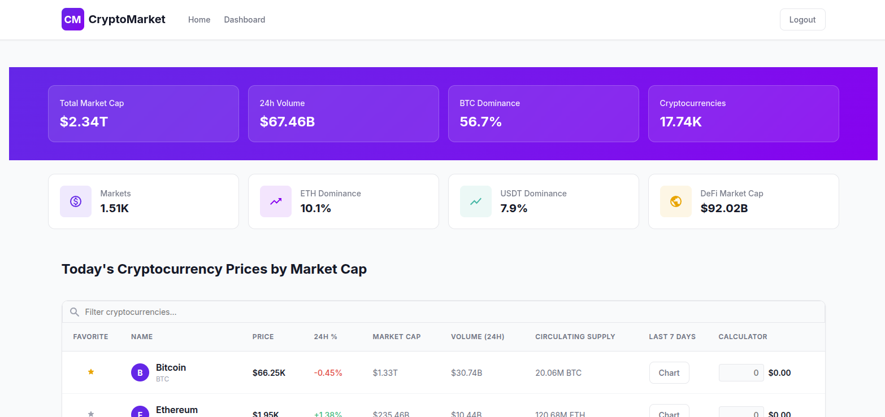
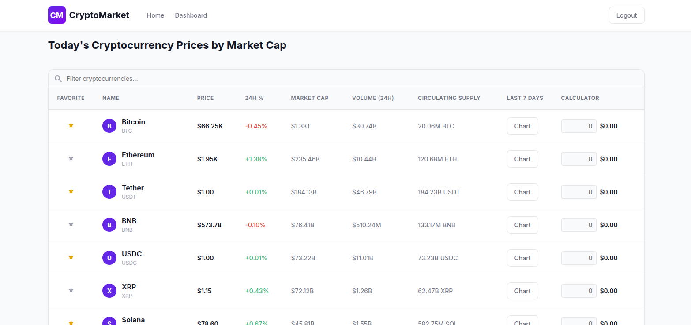


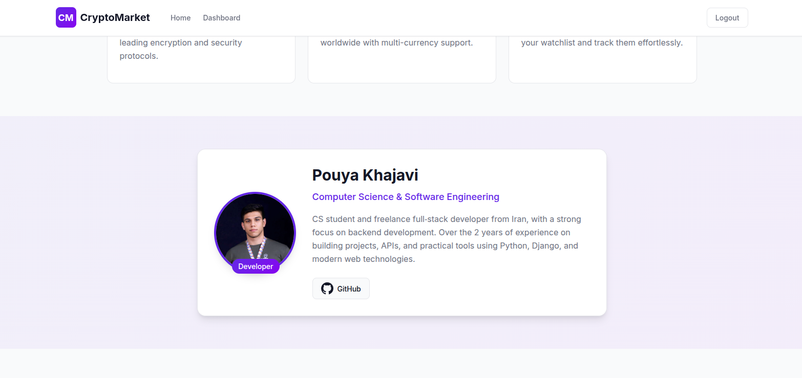
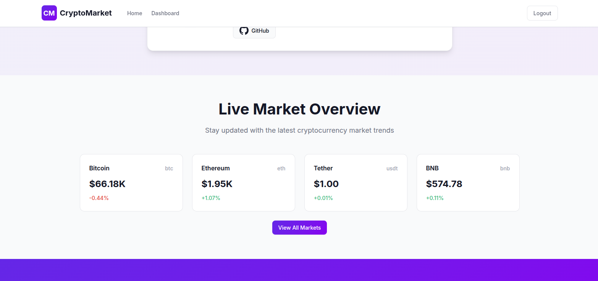
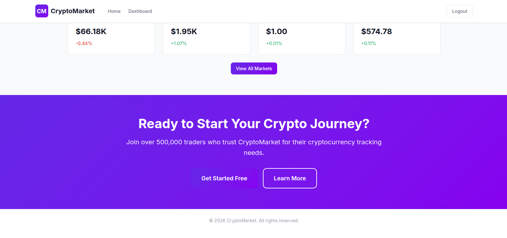
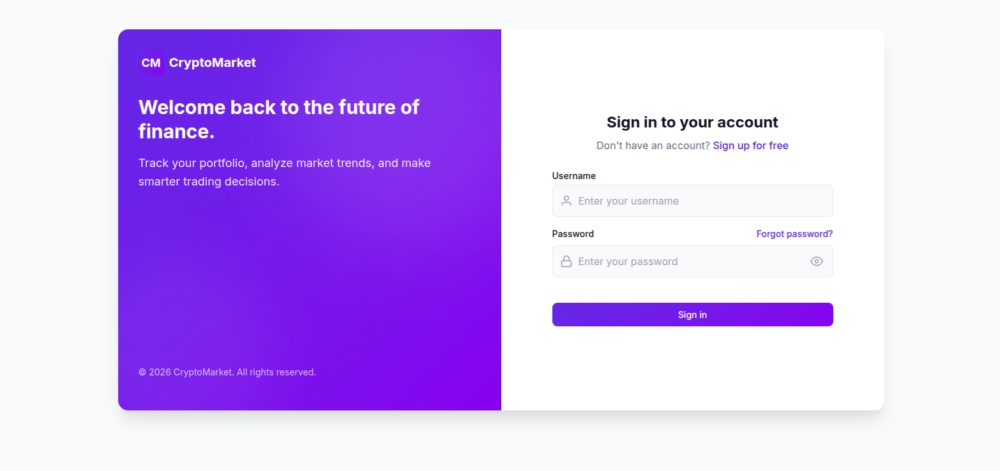
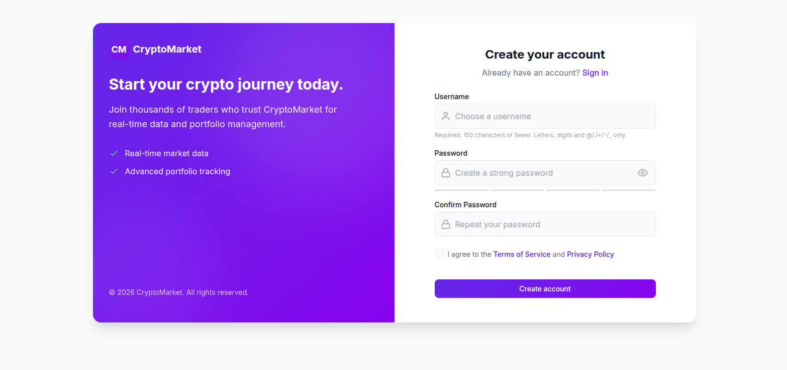

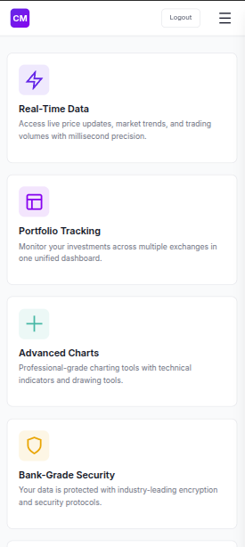
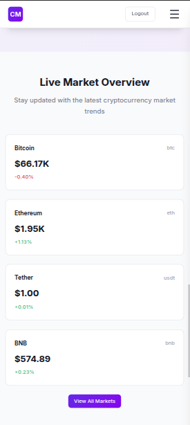
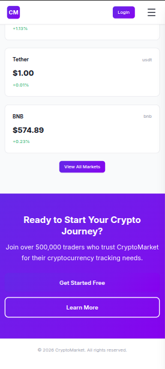
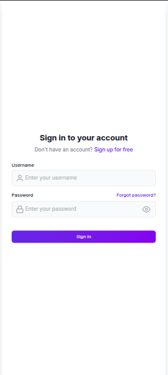
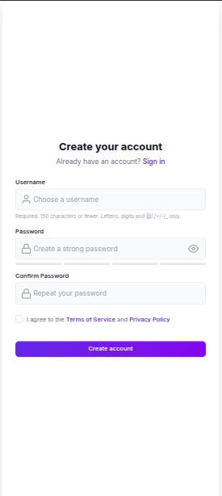
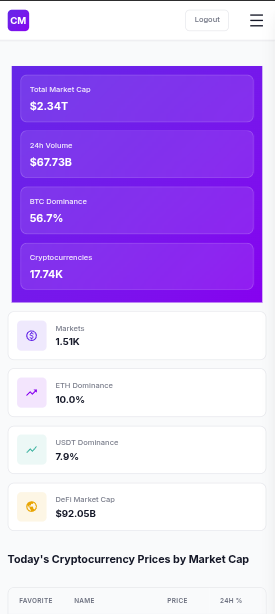
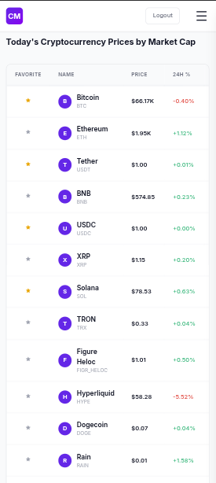
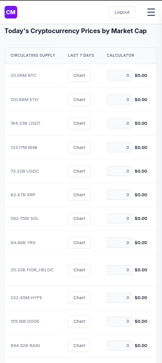

## Key Features

### Frontend & UI/UX

- **Modern Landing Page**: Engaging hero section, feature highlights, developer profile, and testimonials.
- **Responsive Design**: Fully optimized for mobile, tablet, and desktop with a custom slide-in mobile navigation drawer.
- **Real-Time Data Visualization**: Interactive sparkline charts for 7-day price trends using **Chart.js**.
- **Price Calculator**: Built-in real-time calculator in the dashboard table to estimate coin values instantly.
- **Toast Notifications**: Custom, accessible popup system for both server-side (Django) and client-side (JS) feedback.
- **Dark/Light Themed Components**: Clean, card-based UI with a signature purple/violet gradient design system.

### Core Functionality

- **User Authentication**: Secure Sign Up and Sign In flows powered by Django's built-in authentication system.
- **Live Market Data**: Fetches real-time cryptocurrency data (prices, market cap, volume) directly from the **CoinGecko API**.

## 🛠️ Tech Stack

- **Backend**: Python, Django
- **Database**: SQLite3
- **Frontend**: HTML5, CSS3 (Custom Design System), Vanilla JavaScript
- **Data Visualization**: Chart.js
- **API**: CoinGecko API
- **Icons**: Custom inline SVGs

## 🚀 Getting Started

### Prerequisites

- **Docker** and **Docker Compose** installed on your machine.

### Installation & Running

1. **Clone the repository**

   ```bash
   git clone https://github.com/PouyaKhDev/Crypto-Tracker.git
   cd crypto_tracker
   ```

2. **Start the application**

   ```bash
   docker compose up
   ```

   (Optional: Use docker compose up -d to run it in the background)

3. **View the application**
   Open your browser and navigate to http://localhost:8000/.

## Project Structure (Important files)

```text
crypto_tracker/
├── core/               # Main app containing views, URLs, and templates
│   ├── templates/      # HTML templates (Base, Dashboard, Home)
│   ├── static/         # CSS and JS assets
│   └── views.py        # View logic
├── accounts/           # Authentication app (Register/Login Pages)
├── manage.py           # Django management script
├── requirements.txt    # Python dependencies
├── Dockerfile          # Main Dockerfile for the project
├── docker-compose.yml  # Docker compose file to run the application
└── README.md           # Project documentation
```

## ⚠️ API Rate Limits

This project uses the **CoinGecko Free API**.

- The free tier allows up to **100 calls per minute** and **10K calls per month**.
- If you experience missing data or errors, you may have hit the rate limit. Wait a minute and refresh the page.

## 🤖 AI Usage & Transparency

I utilized AI tools to assist with specific aspects of this project's development. AI was used to accelerate the workflow, generate boilerplate code and overcome minor roadblocks.

Specifically, AI assistance was used for:

1. **SVG Icon Creation:** Generating custom, inline SVG code for the user interface icons.
2. **Code Documentation:** Writing descriptive comments and docstrings to ensure the codebase is readable and maintainable.
3. **README Documentation:** Drafting the initial structure and content for this README file (which was subsequently reviewed, refined, and updated by me).
4. **Syntax Refreshing:** Providing quick reminders and corrections for specific HTML, CSS and JavaScript syntax when needed.
